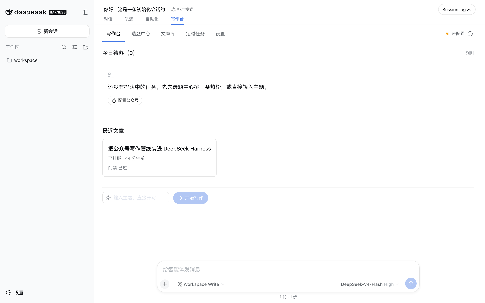
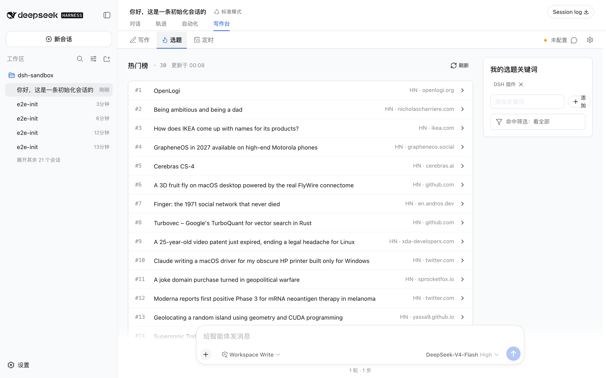
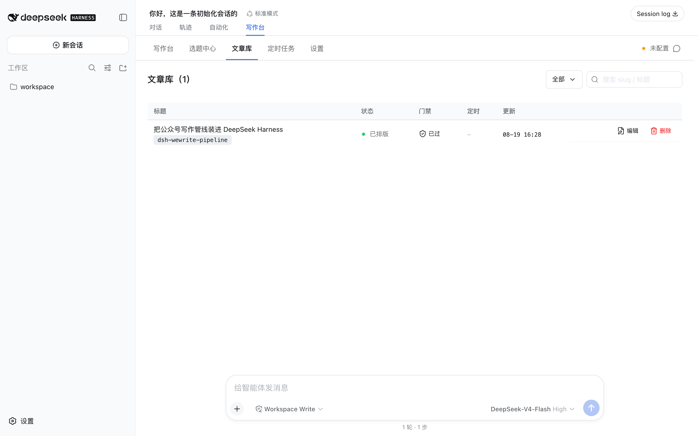
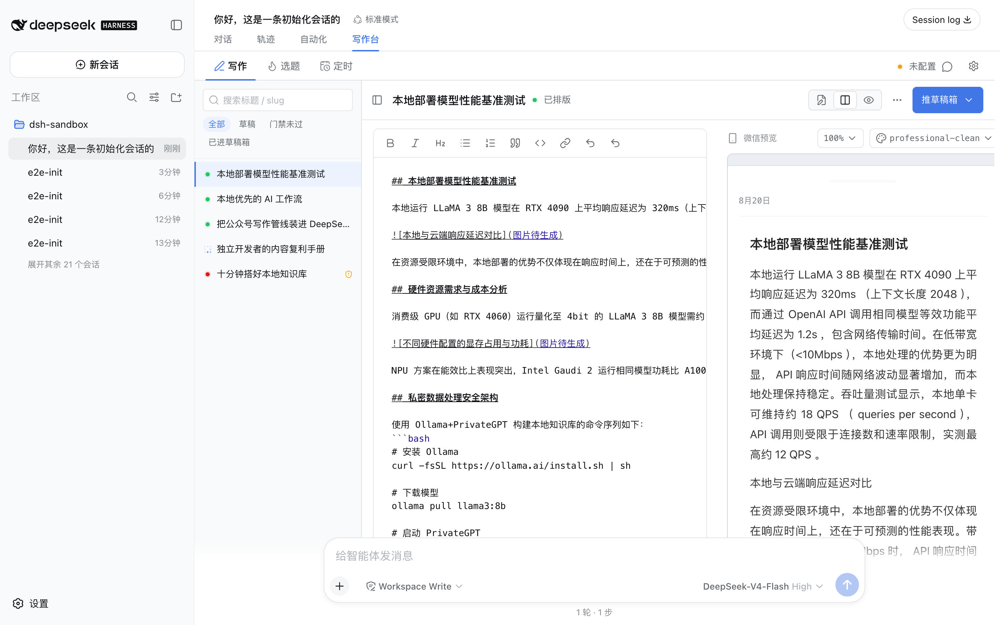
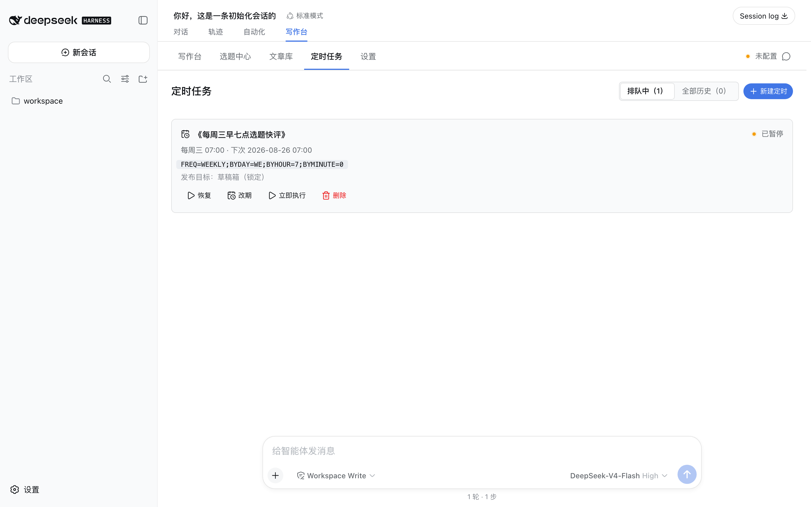
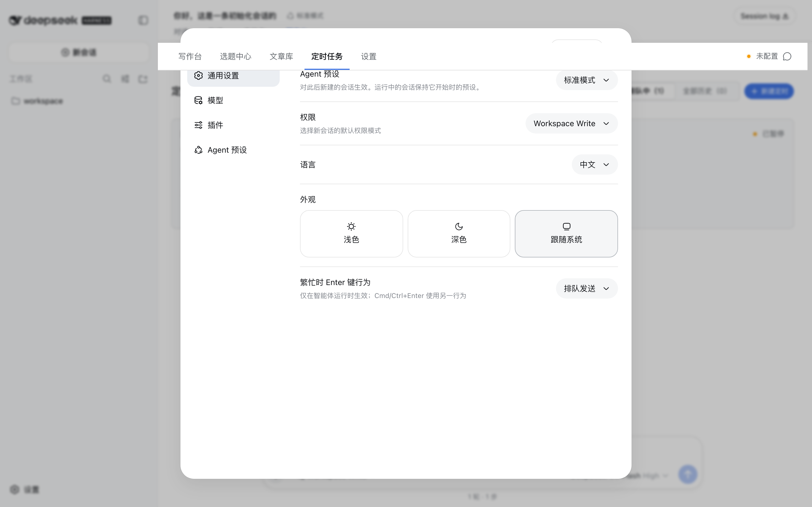
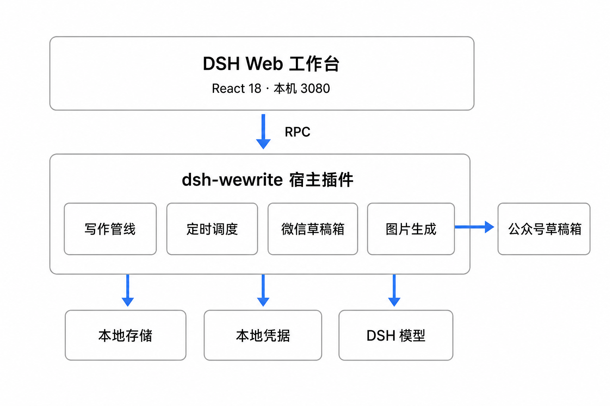

<p align="center"></p>

# dsh-wewrite

[](https://github.com/jerryjiao/dsh-wewrite/actions/workflows/ci.yml)
[](https://github.com/jerryjiao/dsh-wewrite/actions/workflows/website.yml)

一个 [DeepSeek Harness（DSH）](https://github.com/deepseek-ai/deepseek-harness) 插件：把一整套微信公众号 AI 写作管线（选题 → 大纲 → 成稿 → 质量门禁 → 排版渲染 → 配图 → 草稿箱）产品化。任何 DSH 用户一条命令安装，在本地 Web UI 里完成从选题到草稿箱的全流程。模型与凭据全部走你自己的账号，数据只落本地。

- 官网：https://jerryjiao.github.io/dsh-wewrite/
- 版本：v0.1.4
- License：MIT
- 适用 DSH：v0.1.x developer preview（见下方[版本兼容表](#版本兼容表)）

## 5 分钟快速开始

前提：Node `^22.19.0 || >=24.0.0`，已能运行 `npx @deepseek-ai/dsh`。

**第 1 步：安装插件**

```bash
npx @deepseek-ai/dsh plugin --profile web add github:jerryjiao/dsh-wewrite#v0.1.4
```

安装完成后如需卸载：`npx @deepseek-ai/dsh plugin --profile web remove dsh-wewrite`。

> 关于产物形态：仓库直接提交了 `lib/` 预构建产物（dist-committed），这是有意决策——DSH 从 git 安装插件不会执行 build 脚本，预构建路径让你不必在 pnpm 侧加任何 `allowBuilds` 信任声明，装完即用。

**第 2 步：启动 DSH Web**

```bash
npx @deepseek-ai/dsh web
```

打开 http://127.0.0.1:3080 ，会话视图环里会出现「wewrite 工作台」tab。

**第 3 步：配置凭据**

模型不需要在本插件里配：文本生成直接用 DSH 原生的模型配置（`ctx.llm`）。你只需要在工作台「设置」页填：

- 公众号 AppID + AppSecret（来自公众平台「设置与开发 → 基本配置」），保存后只存本地，界面回显掩码
- 图片供应商 API Key（可选，不配则文章无图推进，不阻塞发布）

填完点「连接测试」。通过即可进入下一步；如返回 errcode 40164，见 [FAQ](#faq) 的 IP 白名单条目。

**第 4 步：出第一篇**

「选题」面板选一条热榜（内置 Hacker News，可配自定义聚合源）点「以此为题」，或直接输入固定主题。管线自动执行六步（选题 → 大纲 → 成稿 → 门禁 → 渲染 → 配图），进度实时可见。完成后在编辑器里改稿，右侧微信预览与最终推送产物字节一致。确认后点「推草稿箱」，到微信公众平台后台「内容与互动 → 图文素材」里查看草稿。群发请你在公众平台后台人工执行（本插件 v0.1 没有任何群发调用路径，见[安全声明](#安全声明)）。

## 一步步用起来

以下截图全部来自 v0.1.4 真机运行（本机 DSH Web 实拍），按使用动线排列。

**写作台**

<p></p>

今日待办与最近文章一屏可见，底部输入主题直接开写；未配置凭据时第一步提示「配置公众号」。

**选题中心**

<p></p>

热门榜实时拉取（上图为真实 Hacker News 数据），点「写这个」直接进管线。

**文章库**

<p></p>

每篇文章的状态、门禁结果、定时标记与更新时间集中一处，可搜索、可重推。

**编辑器**

<p></p>

左侧 Markdown 改稿，右侧微信预览与最终推送产物字节一致；门禁报告与推草稿箱在顶部工具栏。

**定时任务**

<p></p>

RRULE 原文与人类可读翻译双行展示，下次运行时间可见，可暂停/恢复。

**设置**

<p></p>

公众号凭据、模型服务、图片供应商链、API 代理分组配置；AppSecret 只回显掩码，连接测试在此。

## 功能亮点

- **主题写作 + 热门榜选题**：固定主题直写，或从热榜选题。内置 Hacker News（官方 Algolia 索引，无需 key），支持自定义聚合源（DailyHotApi 兼容形态，配 URL 即启用）。单源失败只标记该源，不影响其余源展示。
- **Markdown 编辑器 + 微信预览**：CodeMirror 编辑器改稿，右侧实时微信预览（host 侧渲染，预览 HTML 与推送载荷字节一致，所见即所推）。三套排版主题：professional-clean / tech-dark / minimal-gray。
- **质量门禁**：成稿先过门禁（内容质量校验 + 编号配图一致性校验），门禁未过会阻断默认推送路径；你可以改稿重过，或显式覆盖。
- **RRULE 定时，默认进草稿箱**：RRULE 规则（如每个工作日 04:00）定时跑管线，产物恒定推草稿箱，运行历史完整可审计。错过计划时刻不补偿，下次启动时提示错过数。
- **9 家图片供应商，gpt-image-2 优先**：openai（gpt-image-2）→ doubao → dashscope → jimeng → minimax → azure_openai → gemini → openrouter → replicate 的 fallback 链。单家失败自动降级下一家，产物标注实际使用的供应商；全部失败时无图推进，不阻塞成稿。缺省只配 openai 一家，其余按需在设置页增排。
- **模型走 DSH 原生配置**：不另建模型账号体系。管线文本步直接用宿主 `ctx.llm`（即 DSH 设置页里配的模型），也可对单次运行覆盖 provider/model。

## 架构

单包双端（host + client），DSH Cordis 插件形态：

<p></p>

<details>
<summary>文字版</summary>

<pre>
DSH Web UI（React 18，http://127.0.0.1:3080）
  └─ wewrite 工作台 tab
       │  选题 │ 编辑器 │ 微信预览 │ 运行历史 │ 定时计划 │ 设置
       │  connection.rpc（仅 loopback 回环，authority 校验）
       ▼
DSH Host（Node + Cordis）
  └─ dsh-wewrite 宿主插件：WeWriteService（唯一写权威，操作串行化）
       ├─ pipeline/   六步引擎：选题→大纲→成稿→门禁→渲染→配图
       │               文本步调 ctx.llm，确定性步骤纯代码执行
       ├─ scheduler/  RRULE 归一化 → durable occurrence claim → 派发 run
       ├─ wechat/     token / uploadimg / material / draft
       │               apiBaseUrl 可配 = 代理缝（全部调用统一走该地址）
       └─ providers/  9 家图片供应商 + fallback 编排
  凭据：ctx.credentials（~/.dsh 本地）   数据：storageDomain（~/.dsh 本地）
</pre>

</details>

设计细节见 `docs/tech-architecture.md`（ADR-001~009 收录于该文档 §10）。

## 配置说明

全部在工作台「设置」页配置，无需手改文件。机密项（AppSecret、各图片供应商 API Key）只经 DSH 凭据服务落本地 `~/.dsh`，非机密项落插件 storage domain。

**公众号凭据**

| 项 | 说明 |
|---|---|
| AppID / AppSecret | 公众平台「设置与开发 → 基本配置」获取；Secret 保存后界面只回显掩码 |
| 作者名 | 草稿作者字段 |
| 微信 API 地址 | 缺省 `https://api.weixin.qq.com`（直连）。出口 IP 不在白名单时改为你的 relay 地址（见 [tools/wechat-relay](tools/wechat-relay/README.md)） |

**图片供应商链**

- 缺省链只含 openai（模型锁定 `gpt-image-2`，凭据引用 `WEWRITE_IMG_OPENAI`）。
- 可增排其余 8 家（doubao / dashscope / jimeng / minimax / azure_openai / gemini / openrouter / replicate），每家可配专属 API Key、模型名与 base URL；顺序即 fallback 顺序。
- 单图上限 10MB，单篇正文图上限 10 张。

**API 代理**

微信服务端接口有 IP 白名单约束（官方文档：仅白名单 IP 可用 AppSecret / access_token 调用）。本插件把「微信 API 地址」做成一等公民配置项：配成 relay 地址后所有微信调用统一走 relay，无直连混合路径。自建 relay 的最小配置（Caddy 一行）见 [tools/wechat-relay/README.md](tools/wechat-relay/README.md)。

**热榜源**

- 内置：Hacker News（官方 Algolia API，无需 key，恒启用）。
- 自定义：填一个 DailyHotApi 兼容的聚合 API URL 即并入选题面板（条目取 `title` / `url` / `name` 字段）。

**其他**

| 项 | 缺省 | 说明 |
|---|---|---|
| 默认主题 | professional-clean | 三套：professional-clean / tech-dark / minimal-gray |
| 默认图尺寸 | 1024x1024 | 可选 1024x1536 / 1536x1024 / 1344x768 / 768x1344 |
| 运行历史上限 | 200 | 1–1000，超出自动修剪终态记录 |
| Agent 工具 | 关 | 打开后可在 DSH Agent 会话里用 `wewrite_run` / `wewrite_push_draft` / `wewrite_list_schedules` 三个工具 |
| 调度轮询间隔 | 30 秒 | 宿主级配置项（cordis.patch.yml 层） |

## 安全声明

- **默认只到草稿箱**：v0.1 的推送面只有 draft/add 族端点。freepublish / 群发调用路径在类型层不可达（调度目标 zod literal 直接拒绝 publish/freepublish/mass，测试套件另有源码树扫描双保险）。群发永远由你在公众平台后台人工执行。
- **凭据只存本地**：AppSecret 与各 API Key 只经 DSH 凭据服务落 `~/.dsh` 本地存储，不进 git，不离开你的机器；插件自身无任何远端上报通道。
- **日志脱敏**：secret / access_token / API key 在日志、错误与运行历史中一律掩码（长值保留前 4 字符 + `****`，短值全掩）。
- **无默认遥测**：不收集、不上报任何使用数据，无埋点。
- **MIT 开源**：代码见 LICENSE。

## FAQ

**推送报 errcode 40164（invalid ip，不在白名单）怎么办？**

这是微信侧约束：调用服务端接口的出口 IP 必须在公众号白名单里。点设置页「连接测试」，诊断会显示当前出口 IP 与分类指引。两条出路：

1. **出口 IP 加白名单**（适合出口 IP 固定的场景）：公众平台 → 设置与开发 → 基本配置 → IP 白名单，把诊断显示的出口 IP 加入，扫码确认，重测即过。家宽 IP 会变，此路不稳。
2. **自建固定出口 relay**（适合 IP 不固定）：任意有固定公网 IP 的服务器反向代理 `api.weixin.qq.com`（Caddy 一行配置，见 [tools/wechat-relay/README.md](tools/wechat-relay/README.md)），把服务器 IP 加白名单一次，然后设置页「微信 API 地址」改成 relay 地址。本插件不提供也不销售代理服务。

**支持哪个 DSH 版本？装上没激活怎么办？**

见[版本兼容表](#版本兼容表)。DSH v0.1 处于 developer preview 的 breaking changes 窗口，本插件做了 feature detection 防御（storage/connection 服务缺失时警告并降级，而非半死不活）。装上不激活时先确认 DSH 版本在支持列表内；安装输出若出现 "plain dependency" 字样，说明插件声明未被识别，属 DSH CLI 与本插件版本不匹配，请到 [Issues](https://github.com/jerryjiao/dsh-wewrite/issues) 反馈。

**群发功能在哪？**

v0.1 没有，这是有意的安全默认（见安全声明）。Roadmap 的 v0.2 会以**显式 opt-in**（默认关闭，逐次确认）的形式评估提供。

**管线失败会留下半成品草稿吗？**

不会。推送是原子操作：任一环节失败即中止，草稿箱不会出现残稿；已完成的文章产物保留在本地，改好可重推。

## 版本兼容表

| dsh-wewrite | DSH | Node | React | 状态 |
|---|---|---|---|---|
| v0.1.0 – v0.1.4 | v0.1.x developer preview（2026-08-13 发布） | ^22.19.0 \|\| >=24.0.0 | 18（宿主提供，peer） | 已验证（2026-08 基线，DSH master@2026-08-17 实测） |

DSH v0.1 是 developer preview，不承诺 API 稳定；DSH 升级后如插件失活，优先检查本表并升级插件版本。

## Roadmap

- v0.2（评估中）
  - freepublish 显式 opt-in（默认关，逐次确认）
  - 多公众号账号（账号切换/凭据集）
  - 数据回流（已发文章阅读/点赞等统计拉回运行历史）

## 开发

```bash
npm install          # 独立克隆直接装（无 install 钩子）
npm test             # 318 个测试（vitest）
npm run lint         # eslint
npm run typecheck    # tsc --noEmit
npm run check:p0     # 视觉门禁扫描（emoji/渐变/占位文案）
npm run build        # 产出 lib/（提交前必跑，产物入库）
```

项目文档在 `docs/`（PRD / Spec / 技术架构 / QA 测试计划），测试即契约（Spec EARS 验收标准的可执行形态）。

## CI 与发版

三条 GitHub Actions 流水线，全绿是合入与发版的前置：

| Workflow | 触发 | 做什么 |
|---|---|---|
| [`ci.yml`](.github/workflows/ci.yml) | push / PR 到 main | 插件门禁：lint → typecheck → 全量测试 → P0 视觉扫描 → build → `lib/client.js` 加载契约标记校验 + dist-committed 一致性（rebuild 须与提交的 `lib/` 字节一致，防「改源码忘 build」）；另跑官网构建校验（base 前缀验证） |
| [`website.yml`](.github/workflows/website.yml) | push main（`website/**` / logo 变更）+ 手动 | 构建官网并自动部署到 GitHub Pages：https://jerryjiao.github.io/dsh-wewrite/ |
| [`release.yml`](.github/workflows/release.yml) | push tag `v*` | 复用同一套插件门禁 → build → 打包 `lib/` + `cordis.patch.yml` + README/LICENSE 为 zip → 创建 GitHub Release（自动生成 notes）并附产物 |

发版流程（workflow 不改版本号，bump 属本地动作）：改 `package.json` version → 同步 README 安装命令与官网的版本 pin → commit → `git tag vX.Y.Z` → `git push origin main --tags`，`release.yml` 接管门禁与 Release 产物。

## English

**What.** dsh-wewrite is a plugin for DeepSeek Harness (DSH) that turns a WeChat official-account AI writing pipeline—topic, outline, draft, quality gates, render, images, draft box—into a local web workbench. Models and credentials stay yours: text generation uses your DSH model config, secrets never leave `~/.dsh`.

**Install.** `npx @deepseek-ai/dsh plugin --profile web add github:jerryjiao/dsh-wewrite#v0.1.4`, then `npx @deepseek-ai/dsh web` and open http://127.0.0.1:3080 . Fill in your official-account AppID/AppSecret in the workbench settings, run the connection test, pick a topic, and push your first draft. Requires DSH v0.1.x developer preview and Node ^22.19.0 || >=24.0.0.

**Safety.** v0.1 pushes to the draft box only; there is no code path for mass publishing (freepublish), by design. Credentials are stored locally via the DSH credentials service and masked in logs; no telemetry is collected. MIT licensed.

## License

[MIT](LICENSE) — Copyright (c) 2026 Jerry Jiao
